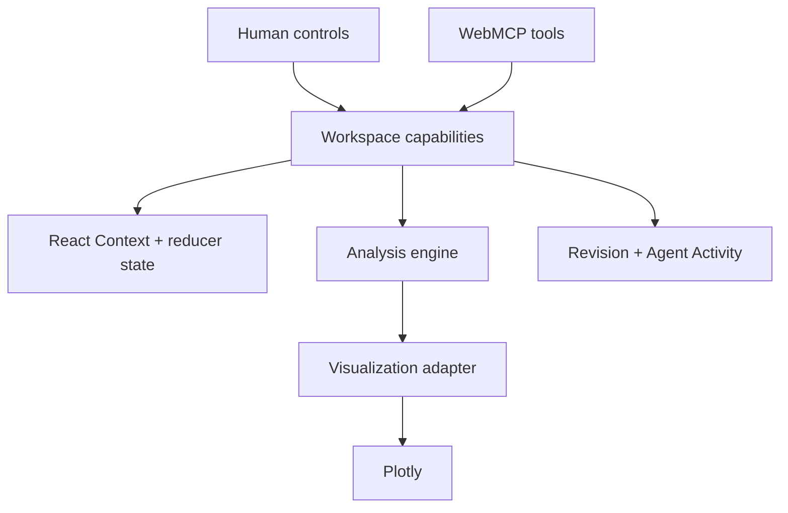

# Median Viz

Median Viz is a collaborative visual analytics workspace where people and browser agents inspect and change the same live analytical state through WebMCP. It turns representative LinkedIn B2B audience-performance data into guarded, explainable views without exposing renderer internals or raw dataset rows.

[**Live Studio**](https://median-viz.vercel.app/studio) · [**Demo video**](https://youtu.be/bZnqu3Oarfs) · [**WebMCP Challenge**](https://webmcp.devpost.com/) · [**MIT License**](LICENSE)

**Tech stack:** Next.js 14 · React 18 · TypeScript · Plotly · WebMCP (`document.modelContext`) · Vercel

> **Demo dataset — representative LinkedIn B2B audience performance data**

The public demo uses only fictional Northstar Media identities. It is not live production data and does not represent a real customer's performance.

## What it does

```text
Inspect the dataset
→ choose a metric and one B2B audience dimension
→ filter or compare Product Campaigns and Product Ad Sets
→ animate the view over time
→ let an agent read or refine the same visible workspace
```

Human controls and agent calls are deliberately interleavable. A person can select a Product Campaign, an agent can refine the metric or pivot, and both immediately see the same revisioned state. Successful agent mutations appear in the Agent Activity rail.

## Why WebMCP

WebMCP lets the page expose domain-level capabilities instead of asking an agent to infer intent from DOM structure or manipulate Plotly directly.

- Human controls and WebMCP tools call the same workspace capability layer.
- Read tools describe the current dataset, workspace, and bounded result summary.
- Mutation tools accept strict, bounded inputs and use optimistic revision checks.
- Unsupported demographic intersections fail closed without creating invalid UI state.
- Agent mutations are visible and attributable in Agent Activity.
- Plotly remains a derived visualization adapter, never the canonical state.

## WebMCP tools

The hosted Studio registers exactly seven browser tools.

### Read-only

| Tool | Purpose |
|---|---|
| `inspect_dataset` | Returns supported pivots, comparisons, metrics, dates, quality semantics, and constraints without raw rows. |
| `get_workspace_state` | Returns the current revision, selections, filters, chart, animation frame, metric availability, and warnings. |
| `get_current_result_summary` | Returns aggregate-safe totals and a deterministic bounded top/bottom segment summary. |

### Guarded mutations

| Tool | Purpose |
|---|---|
| `configure_analysis` | Updates supplied metric, single demographic pivot, comparison, or compatible visualization fields. |
| `apply_filters` | Replaces supplied Product Campaign, Product Ad Set, or date-range filters using canonical values. |
| `set_animation` | Enables, pauses, or positions the supported day-by-day time view. |
| `reset_view` | Resets analytical, filter, visualization, and animation state while preserving the dataset. |

All four mutation tools call semantic workspace capabilities. They do not access reducer internals, write dataset rows, or control Plotly directly.

## Example interactions

- “What can I break this audience down by?”
- “Show CPC by Industry across Product Ad Sets.”
- “Limit this to Growth Leaders.”
- “Which industries have the highest CPC now?”
- “Show how this changed day by day.”
- “Compare Job Function with Seniority.”

The final request is intentionally rejected with `unsupported_demographic_intersection`. LinkedIn demographic pivots are independently reported, so Job Function and Seniority cannot be crossed in one analytical query.

## Demo dataset

The representative fixture covers August 8–21, 2026 and preserves the shape and quality semantics expected by the canonical adapter. It contains two fictional Product Campaigns, three fictional Product Ad Sets, and nine independently reported demographic pivots:

- Job Function
- Seniority
- Job Title
- Company
- Company Size
- Industry
- Country
- Region
- County

Exactly one demographic pivot is valid per analytical query. It may be grouped by Product Ad Set, Product Campaign, or time, but never aggregated across another demographic pivot.

The fixture preserves status-only evidence, unresolved labels, nullable metrics, privacy-adjusted semantics, and the `daily_provisional_directional` quality designation. It contains no real customer identity and is not connected to Cloud SQL or a backend service.

## Architecture



- **Canonical state:** React Context and a reducer hold selections, filters, visualization, animation frame, and revision.
- **Capability boundary:** human controls and WebMCP mutations share validation and transition logic.
- **Analysis engine:** filters and aggregates canonical rows before calculating derived metrics.
- **Visualization adapter:** converts valid results into Plotly traces and layout.
- **Concurrency:** `expectedRevision` makes stale agent writes fail closed.
- **Privacy:** canonical identity validation and source/generated-output scans prevent public-demo leakage.

## Correctness and safety

Derived metrics are calculated from aggregate raw measures:

- CTR = `sum(clicks) / sum(impressions)`
- CPC = `sum(spend) / sum(clicks)`
- CPM = `sum(spend) × 1000 / sum(impressions)`
- CVR = `sum(conversions) / sum(clicks)`
- CPA = `sum(spend) / sum(conversions)`

Supported and available are separate states. For example, CPA and CVR are supported but remain unavailable and `null` when no conversions exist; missing, suppressed, or status-only evidence never becomes zero.

Additional safeguards:

- exactly one demographic pivot per analytical query;
- strict tool schemas and canonical demo-safe filter values;
- stale revisions and invalid visualization combinations fail without mutation;
- public identity allowlisting plus an external private-denylist build gate;
- no browser-persisted demo identity or workspace state;
- no raw fixture rows, source Campaign identifiers, or Plotly internals in WebMCP output;
- duplicate tool registration is lifecycle-safe.

## Run locally

Requirements: Node.js 22.x and npm.

```bash
git clone https://github.com/rdukb/median_viz.git
cd median_viz
nvm use
cd apps/web-next
npm ci
npm run dev
```

Open `http://localhost:3000/studio`.

Run the verification suite from `apps/web-next`:

```bash
npm test
npm run eval:webmcp
npm run build
```

Submission-freeze verification: **56 tests passed**, **12 WebMCP scenarios passed**, and the production build completed with source and generated-output privacy scans.

The primary route is `/studio`. The original `/pie`, `/bar`, and `/map` routes remain available as legacy chart-gallery examples.

## Deployment

The Studio is deployed on Vercel at [median-viz.vercel.app/studio](https://median-viz.vercel.app/studio). The deployable app root is `apps/web-next`, the runtime is Node.js 22.x, and the guarded production build runs both source and generated-output privacy validation.

Private denylist values and local filesystem paths are never committed or documented. See the [deployment preflight and rollback contract](apps/web-next/DEPLOYMENT_PREFLIGHT.md).

## Original Python Plotly CLI

The repository began as a small Python Plotly visualization CLI. It remains available for generating standalone HTML chart artifacts and is separate from Studio/WebMCP.

```bash
conda env create -f environment.yml
conda activate median_viz

python viz.py --type pie
python viz.py --type bar --top-n 10
python viz.py --type map
```

Supported options:

| Option | Meaning |
|---|---|
| `--type map\|bar\|pie` | Required visualization type. |
| `--data PATH` | Optional input CSV override. |
| `--out PATH` | Optional output HTML path. |
| `--top-n NUMBER` | Bar-race item limit; defaults to 8. |

Default data files live under `data/`, and generated HTML is written under `dist/`.

## Documentation

- [Web UI guide](WEB_UI_GUIDE.md)
- [Frozen Studio interaction and data contract](apps/web-next/STUDIO_PROTOTYPE.md)
- [Deployment preflight and rollback contract](apps/web-next/DEPLOYMENT_PREFLIGHT.md)
- [WebMCP evaluation guide](apps/web-next/evals/README.md)
- [Web app package notes](apps/web-next/README.md)

## License

Median Viz is available under the [MIT License](LICENSE).
